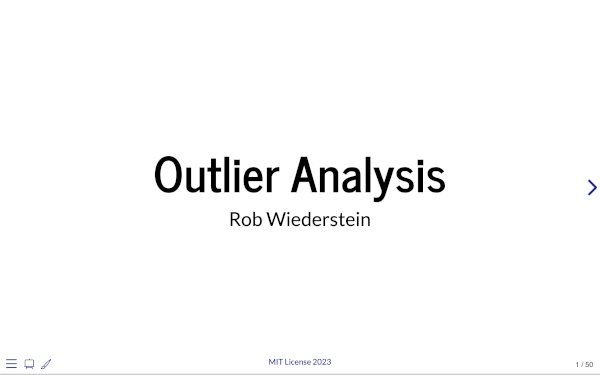

# outliers_pres

The `outliers_pres` is a quarto presentation on outlier analysis. The presentation was accompanied with a release of an interactive dashboard illustrating the concepts.  The dashboard is available online [here](https://rob-wiederstein.shinyapps.io/outliers_dash/).

## Acknowledgements

- Professor Talagala whose academic paper and numerous repositories have been extremely helpful and form the basis of this dashboard.

- Centers for Medicare and Medicaid Services for the publicly available claims data.
